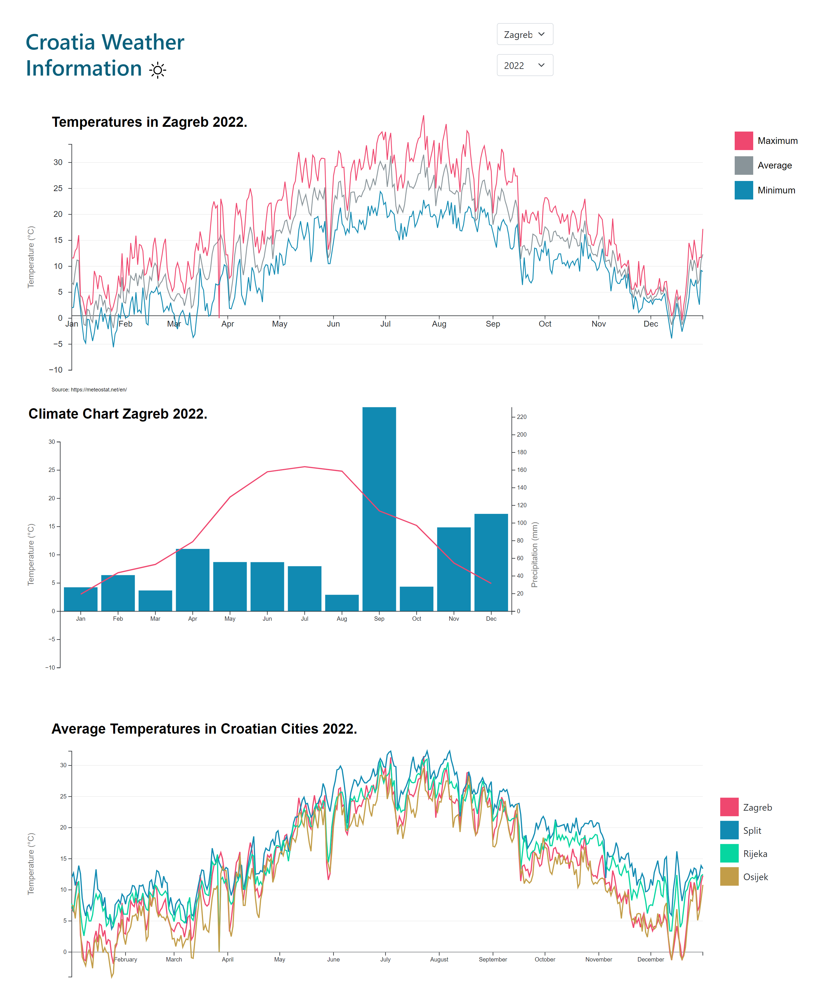

# Croatia Weather Information
Croatia Weather Information is a website built with D3, Vanilla CSS and Bootstrap. The project is based on weather station data. The idea is to facilitate the presentation of the differences in temperature and climate of the four largest Croatian cities. In all diagrams, the display changes depending on the selected year from the drop-down menu, and the first two diagrams also change the display depending on the selected city.

## Page layout

    </img>  

